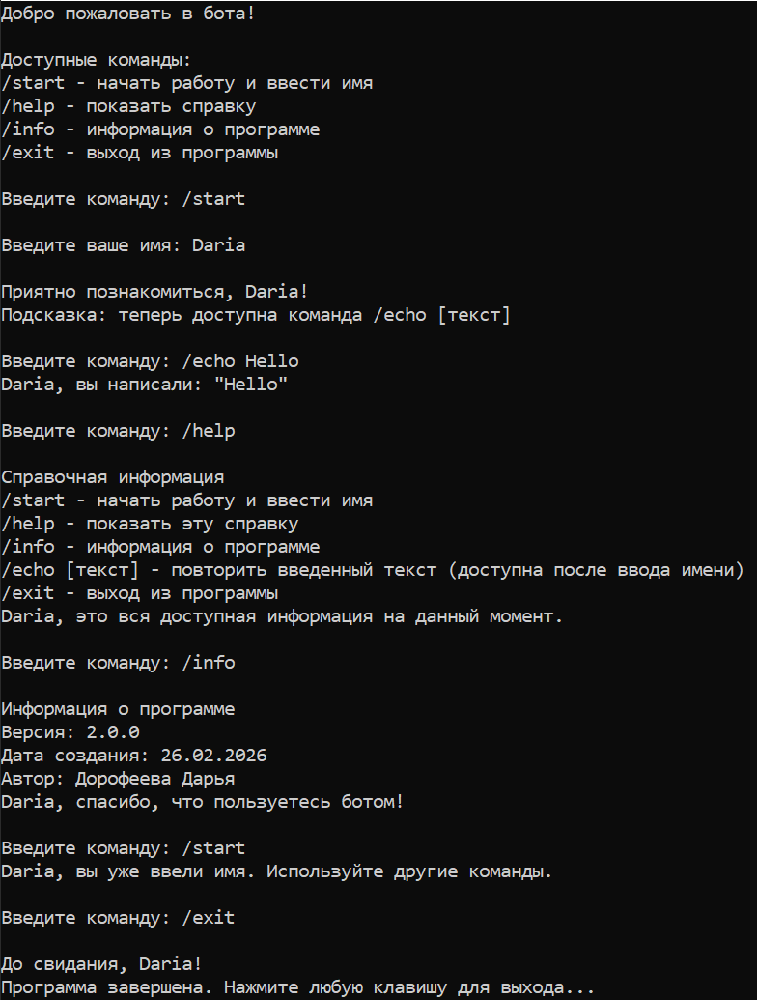

# 🤖 Консольный бот с интерактивным меню

## 📋 Описание проекта
Консольное приложение, имитирующее работу Telegram-бота с интерактивным меню. 
Разработано в рамках домашнего задания для демонстрации работы с переменными, 
методами и операторами управления.

## 🚀 Запуск проекта
1. Убедитесь, что установлен .NET SDK
2. Откройте проект в Visual Studio
3. Запустите проект (Ctrl+F5)

## 🎮 Доступные команды
| Команда | Описание |
|---------|----------|
| `/start` | Начать работу и ввести имя |
| `/help` | Показать справочную информацию |
| `/info` | Информация о программе |
| `/echo [текст]` | Повторить введенный текст |
| `/exit` | Выход из программы |

## 📸 Демонстрация работы

## ✅ Критерии выполнения
- ✔ Приветственное сообщение и список команд
- ✔ Обработка `/start` и сохранение имени
- ✔ Обращение к пользователю по имени
- ✔ Справка по `/help`
- ✔ Информация о версии и дате по `/info`
- ✔ Обработка `/echo` с аргументом
- ✔ Основной цикл программы

## 👤 Автор
Дорофеева Дарья  
Дата создания: 26.02.2026

## 📄 Лицензия
Этот проект распространяется под лицензией MIT.